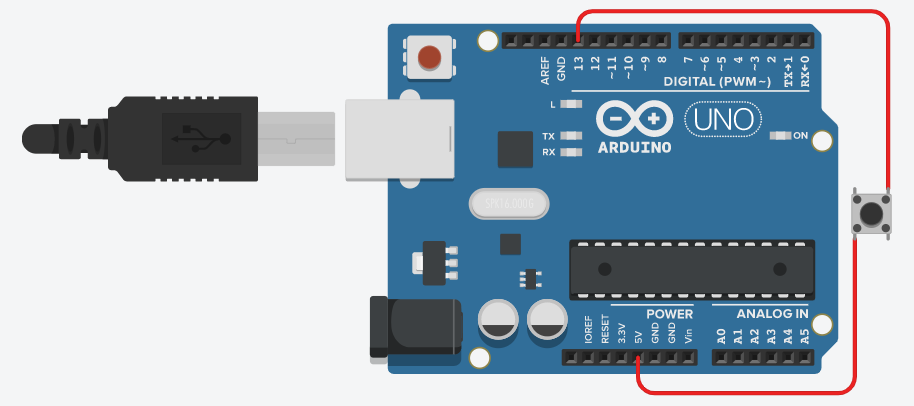

# Botão tátil

Ter uma forma que permita ao usuário inserir alguma informação para modificar o estado do código é algo essencial na computação. Um exemplo disso é o teclado, que nada mais é do que um conjunto de botões. 

Os botões táteis mais comuns e que normalmente são utilizados em projetos de Arduino possuem 4 terminais, sendo que eles são conectados internamente aos pares, como demonstrado na imagem abaixo. Um botão tátil nada mais é que um interruptor que, quando apertado, faz o contato entre os dois terminais, e, no momento em que é “solto” desfaz esse contato. 

Uma forma de utilizá-lo com o Arduino está demonstrada na imagem abaixo. Quando acionado, o botão permitirá a passagem de corrente entre o terminal de saída da placa até o pino 13, fazendo com que o LED da placa seja ligado.

Porém existe um problema prático nesta forma de se utilizar botões táteis. Quando o botão não está acionando, o pino digital 13 não está necessariamente recebendo um sinal terra (ou seja, 0V correspondendo ao estado LOW)  devido a possíveis interferências eletromagnéticas. Então, ao fazer um projeto um pouco maior, com diversos jumpers e dispositivos próximos, a probabilidade da porta digital receber um valor aleatório aumenta. Para contornar isso, existe uma forma de configurar o botão de tal forma que quando não pressionado, seja enviado à porta digital o valor de LOW (modo PULL-DOWN) ou HIGH (modo PULL-UP)  por padrão, eliminando o problema da interferência.

Para fazer com que o botão fique configurado de modo PULL-DOWN, basta conectar no pino de digital, além do botão, um resistor (de preferência com uma resistência relativamente alta, como 10KΩ para evitar um consumo desnecessário de energia), como demonstrado na imagem abaixo.

Este circuito funciona da seguinte maneira: quando o botão não está pressionado, o terminal GND está em contato direto com o pino digital, sendo assim, estará sempre no modo LOW. Ao ser pressionado, o botão cria o contato entre o 5V e o pino digital. A corrente, então, tem dois possíveis caminhos para seguir: pode ir tanto para o pino GND (causando um curto circuito) ou para o pino digital. A corrente elétrica sempre segue o caminho com menos resistência, então como não há resistência até o pino digital (tecnicamente existe a resistência do fio, mas é desprezível) e por haver um resistor com resistência relativamente alta no caminho para o pino GND, a corrente irá para o pino digital, acionando o LED da placa Arduino.

Para realizar a construção do botão no modo PULL-UP, basta conectar o resistor no terminal de 5V (ou de 3V se for o caso) e o terminal GND diretamente ao botão. Dessa forma, o pino digital estará em modo HIGH sempre que o botão não estiver sendo pressionado.
