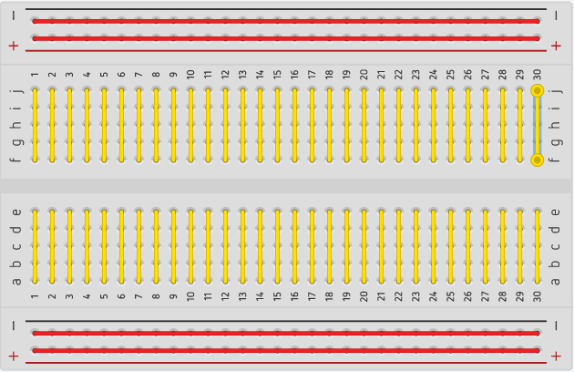

# Protoboard

[//]: # (Talvez não seja o melhor lugar para se colocar essa sessão e esse conteúdo, vamos ver ao decorrer do curso se há a necessidade de uma página separada para isso ou se é melhor mesclar o conteúdo daqui com outras páginas  -    falar de componentes como led, resistor)

Também conhecida como “placa de ensaio”, “matriz de contato” ou até mesmo “breadboard”, a Protoboard,  como é comumente chamada no meio do Arduino, é uma placa com furos com linhas de contatos entre eles, utilizada na montagem de protótipos. Se encaixa perfeitamente no contexto no contexto desse curso. Testes e modificações são partes quase que intrínsecas de um projeto em Arduino, ainda mais quando se está no processo de aprendizagem. 

Protoboards consistem basicamente dois grupos faixas, são eles:

+ Faixa de terminais: faixa de contatos onde são instalados os componentes eletrônicos. São trilhas dispostas na vertical, geralmente em grupos de cinco conectores e com um entalhe, demarcando a linha central da placa (que normalmente é espelhada) e para melhor acomodamento de circuitos integrados e outros componentes que possam a vir a ser instalados.
+ Faixa de barramentos: Usadas para o fornecimento de tensão ao circuito, constituída de duas faixas horizontais na extremidade, uma reservada para o condutor negativo (terra, marcada em preta ou azul) e outra para o positivo, marcada em vermelho. 

É possível imaginar elas como se fosse um único fio (e de fato há uma pequena faixa metálica conectando eles) assim ao plugar um componente em um terminal, é como conectar ele a todos outros componentes em toda faixa. É possível ver o alinhamento dos terminais na imagem abaixo.

 

Poder facilmente modificar posições de peças, rearranjar cabos, adicionar novos componentes é [NÃO TO CONSEGUINDO ESCREVER ALGO LEGAL AQUI, era pra ser algo positivo]. Porém existem lados negativos em seu uso, “mau-contato” entre os terminais, resistência entre os contatos da placa e os componentes encaixados além de que um elevado número de “jumpers” pode causar interferência em outros componentes, por isso, recomenda-se o uso de “jumpers” curtos e não se fazer muitos cruzamentos entre eles.
