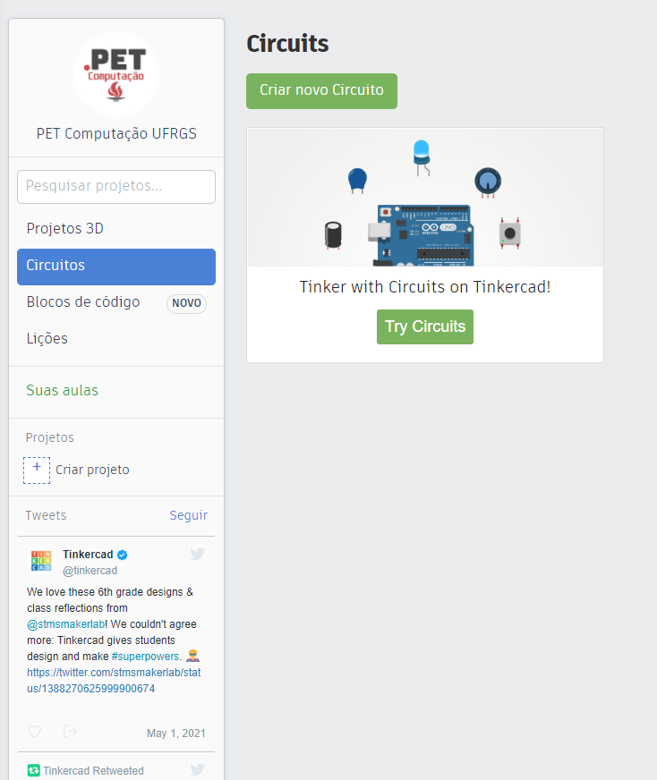
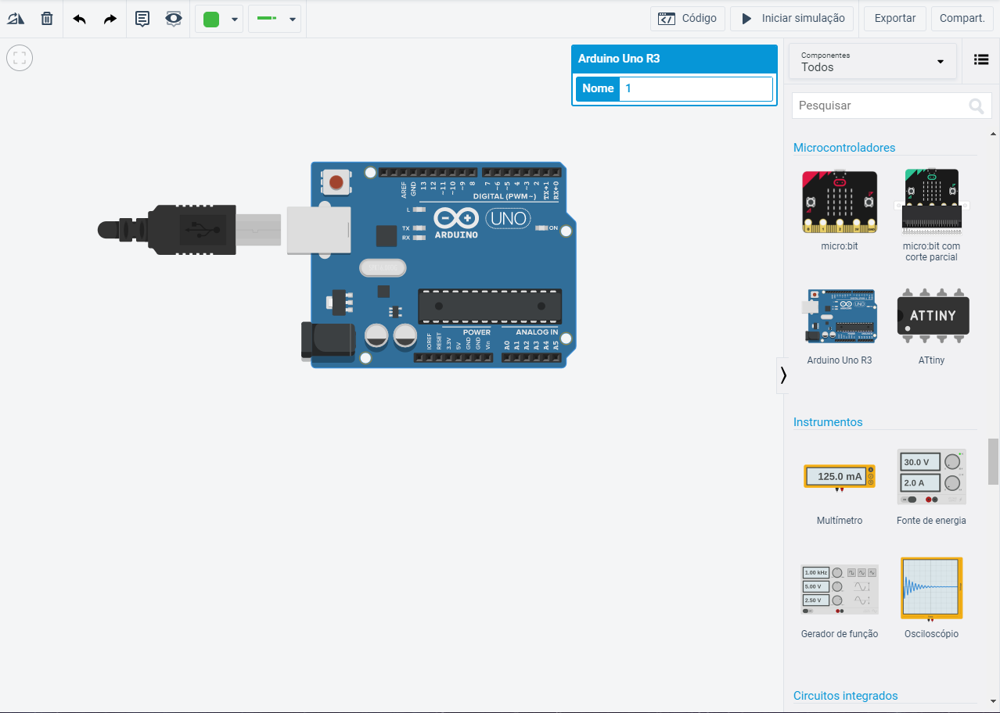

# Plataforma Tinkercad

O Tinkercad é uma plataforma online e gratuita que apresenta recursos para o aprendizado, proporcionando a possibilidade de criação e simulação de modelos 3D e circuitos, incluindo o Arduíno. Para utilizar a plataforma, basta criar uma conta no [site oficial](https://www.tinkercad.com/) e após com um simples clique é possível criar um novo projeto de circuitos. 

 

O Tinkercad oferece uma vasta gama de componentes eletrônicos para utilizar, que aparecem no painel à direita, existem várias categorias de componentes, desde os básicos (leds, botões, sensores e baterias), circuitos integrados, transistores, chips de lógica, instrumentos de medida (multímetro, osciloscópio) e microcontroladores (incluindo o Arduíno Uno R3). Um laboratório completo onde o limite é a imaginação do usuário. Por ter uma interface drag-and-drop, basta arrastar os componentes para a posição desejada. Tente arrastar uma placa Arduino para a área de projeto, como na imagem abaixo, caso não consiga encontrar a placa, basta digitar seu nome na barra de busca acima da lista de componentes.

 

Você notará que na barra superior existe um botão de código, ao clicar nele a aba de programação é aberta.  O Tinkercad possibilita dois tipos de programação, uma utilizando código, da mesma forma que se programa em uma IDE e em forma de blocos, baseada na linguagem Scratch.

 

É possível notar que no exemplo padrão, o LED incorporado à placa (ver [Anatomia do Arduíno](./anatomia-do-arduino-uno.md)) irá piscar com um intervalo de 1 segundo. Ao clicar em `Iniciar simulação`, na barra superior, é possível ver esse comportamento na placa. 
Não só é possível programar em blocos, mas também ver o equivalente em código, assim, a ferramenta acaba se tornando poderosíssima no aprendizado, visto que traduz algo em uma linguagem simples e visual em código para o arduino. Para habilitar essa visualização, basta mudar do modo `Blocos` para `Blocos + texto`. Para este exemplo inicial de piscar o led temos exatamente o mesmo código de exemplo que foi utilizado para testar a IDE. Note que não é possível editar o texto, para fazer isso é necessário mudar para o modo `Texto`

__CUIDADO:__ Ao mudar para o modo `Texto` uma mensagem de aviso é mostrada na tela. Esteja ciente que ao clicar em Continuar, todos os blocos serão perdidos. O código gerado por eles continuaram, mas o processo inverso NÃO É POSSÍVEL. Ou seja, uma vez mudado para o modo onde o texto do código é editável, não é possível retornar ao modo de edição em blocos, e qualquer tentativa de fazer isso fará com que seu código vire o exemplo padrão (LED embutido piscando a cada 1 segundo).
