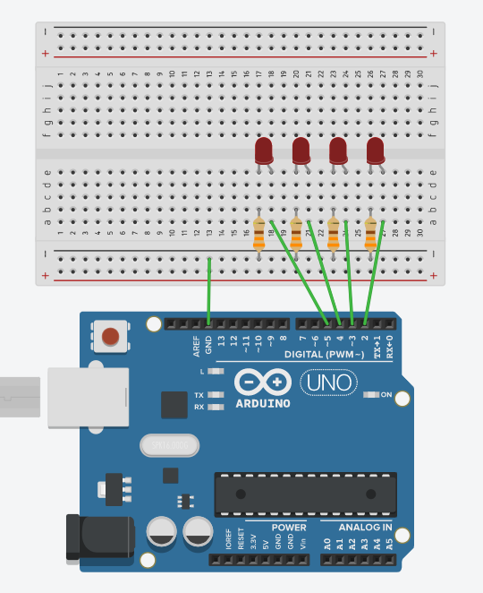

# Primeiro projeto - Contador binário

Agora que você sabe o básico do funcionamento do Arduíno e de alguns componentes eletrônicos, juntar esse conhecimento e fazer um projeto pequeno projeto, pois a prática é essencial para o fixamento do aprendizado. Aqui você aprenderá a fazer um contador binário de 4 bits, ou seja, contará de 0 a 15. 

### Hardware
#### Materiais necessários
+ 4 LEDs 
+ 4 resistores de 330 Ω
+ 5 jumpers

#### Esquemático


Utilize jumpers para conectar o terminal positivo (Anodo) de cada um dos LEDs em um pino digital da placa. A escolha dos pinos é arbitrária, mas lembre-se de inserir corretamente no momento de escrever o software. 
Insira nos terminais negativos (Catodo) o resistor, conectando a trilha negativa da faixa de barramentos e um jumper conectando a trilha ao pino GND da placa. 

## Software

Primeiramente é necessário fazer uma declaração para ter um controle mais facilitado sobre os LEDs. Para isso basta inserir no início do código `int led[] = {3, 4, 5, 6};`. Neste vetor você deve colocar os pinos digitais em que os leds estarão conectados na placa Arduino.
Após, dentro da função `setup()` precisa-se configurar os pinos dos leds como `OUTPUT`, a função ficará da seguinte forma:
```C
void setup()
{
    pinMode(led[0], OUTPUT);
    pinMode(led[1], OUTPUT);
    pinMode(led[2], OUTPUT);
    pinMode(led[3], OUTPUT);
}
```
Uma forma alternativa e mais otimizada de realizar tal operação é utilizar um laço, como estamos lidando com vetores, isso aparece naturalmente, a função ficará da seguinte forma:
```C
void setup()
{
  for (int i=0; i<4; i++)
  {
    pinMode(led[i], OUTPUT);
  }
}
```
Com todos os pinos configurados, é possível trabalhar agora na função `loop()`. Como a contagem é de 0 a 15, é necessário fazer um laço `for()` apropriado para isso onde será criada uma variável, chamada de `num` que irá percorrer de 0 até 15.

  `for (byte num=0; num<=15; num++)`

### A função bitRead()
A função `bitRead(num, n)` é essencial para este projeto, a função lê o bit `n` (sendo 0 o bit menos significativo) de um dado valor `num`. Por exemplo, o valor 13 que é representado em binário como sendo `1101`, os bits __0__, __2__ e __3__ são *1*, enquanto o bit __1__ é *0*. 
Será necessário checar cada um dos 4 bits da variável `num`, para que os LEDs possam ser definidos de acordo com o valor retornado pela função `readBit()`. Para isso, outro laço deve ser criado `for (int n=0; n<=3; n++)`. A cada iteração do laço, será feita a verificação de cada bit do número, utilizando a função `bitRead()`, caso ela retorne `1`, o um sinal `HIGH`será enviado para o pino do LED, fazendo com que ele acenda, caso contrário, um sinal `LOW`, fazendo com que ele apague.

```C
if (bitRead(num, n) == 1)   
  {
    digitalWrite(led[n], HIGH);
  }
    else
  {
    digitalWrite(led[n], LOW);
  }
}

```
Tecnicamente, o contador está pronto. Mas o que acontecerá ao rodar o código desta maneira? Você provavelmente irá ver todos os leds acesos, ou até quem sabe apagados. Isso acontece pois o código roda tão rápido e os LEDs estão constantemente se acendendo e apagando que você tem uma impressão de continuidade. Para que possa-se ver os efeitos do contador nos LEDs, é necessário usar uma função de delay. 2 segundos é um bom tempo para ver o contador funcionando. Acrescente após o laço for `delay(2000);`.

O código completo ficará da seguinte maneira: 


``` C
/* Programa com a implementação de um contador binário de 4 bits utilizando LEDs */

int led[] = {2, 3, 4, 5};   // Vetor representando os pinos dos leds

void setup()
{
  // Seta todos os pinos dos leds como OUTPUT
  for (int i=0; i<4; i++)
  {
    pinMode(led[i], OUTPUT);
  }
}

void loop()
{    
  for (byte num=0; num<=15; num++)
  {
    for (int n=0; n<=3; n++)
    {    
      if (bitRead(num, n) == 1)   
      {
        // Se o bit lido for 1, o led na posição correspondente irá acender
        digitalWrite(led[n], HIGH);
      }
      else
      {
        // Caso o bit for 0, o led irá apagar
        digitalWrite(led[n], LOW);
      }
    }
    // Delay de 2 segundos para o contador ser perceptível.
    delay(2000);
  }
}
```
