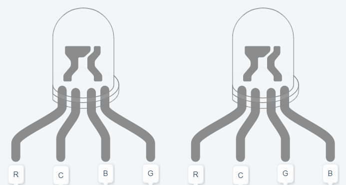
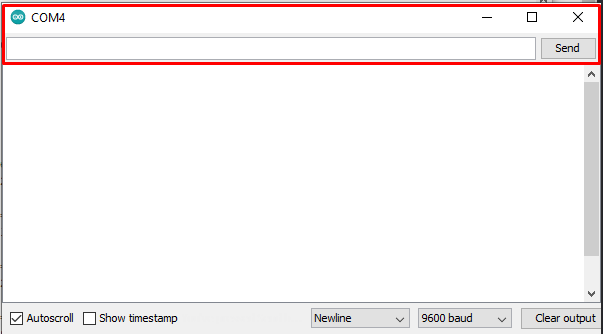

# Controlando LED RGB através do computador

Utilizando a porta Serial é possível não apenas receber dados da placa Arduino e trabalhar com eles através do computador, como também enviar dados do computador para a placa. Neste projeto você conseguirá controlar a cor de um LED RGB a partir do seu computador, utilizando a porta Serial. É fortemente recomendado que tenha-se conhecimento em manipulação de strings em C.

Um LED RGB é, na verdade, a junção de 3 leds de cada uma das 3 cores primárias (vermelho (Red), verde (Green) e azul (Blue), formando assim a sigla em inglês RGB). Possui 4 terminais, sendo 3 deles reservados para acionar cada LED e o último (que pode ser diferenciado como o maior de todos os quatro) utilizado como ânodo comum ou cátodo comum, dependendo do tipo do LED; por essa razão ele é chamado apenas de __comum__. Abaixo é possível ver as disposições dos terminais, lembrando que deve-se ter como referência o maior pino (representado pela letra __C__), que é o terminal comum. No lado esquerdo da imagem é representado os terminais da maioria dos LEDs RGB, enquanto que no lado direito tem-se a forma especificada por alguns fabricantes, sendo também a forma utilizada pelo __Tinkercad__.



A diferença entre leds do tipo anodo comum e catodo comum se dá na maneira que os LEDs são conectados internamente. No caso do anodo comum ambos, os LEDs compartilham o terminal positivo, enquanto no catodo comum os LEDs compartilham o terminal negativo. 
Uma das formas de descobrir qual é o tipo de LED, basta utilizar um multímetro  no modo continuidade. Coloque o terminal negativo do multímetro no maior pino do LED (pino comum) e o outro terminal em qualquer um dos 3 pinos de cor. 
Caso o LED acenda, ele é catodo comum. Se o teste anterior não der resultados, inverta os terminais do multímetro; se o LED  acender, é anodo comum. Caso você não tenha um multímetro, não se preocupe, pois a diferença no código resultante dessa mudança é pouca, ou seja, ao rodar o projeto pela primeira vez, você verá caso tenha escrito ele na forma para catodo comum enquanto o LED é anodo comum, ou vice-versa. 

Agora que você sabe identificar o seu LED, deve estar se perguntando a diferença prática disso. Quando ele é do tipo catodo comum, o seu terminal comum deve ser conectado ao terminal GND, nesse caso o arduino estará controlando diretamente a voltagem aplicada a ele, ou seja, se a placa estiver enviando 5V (representado pelo valor 255 na função `analogWrite()` para a cor vermelha, a diferença de potencial será de 5V, fazendo com que o LED acenda com o máximo de brilho vermelho. Já no caso do anodo comum, o terminal comum deve ser conectado em 5V, assim ao enviar o valor 255 com a função `analogWrite` (5V) o LED simplesmente permanecerá apagado, pois a diferença de potencial será 0V.


### Hardware
#### Materiais necessários:
+ 1x LED RGB
+ 3x resistor 220Ω

#### Esquemático 


Lembre-se que caso o LED utilizado for anodo comum, você deve conectar o terminal comum em 5V.

### Código
Como de costume, é necessário declarar os pinos em que o LED estará conectado. Será necessário utilizar os pinos digitais com suporte a PWM (para mais detalhes, cheque o [projeto PWM - Controlando a intensidade do LED]()). Também será necessário criar uma variável do tipo `String` onde o input com a cor desejada será armazenado.

```C 
const int gLed = 9;
const int bLed = 10;
const int rLed = 11;
String cor;
``` 

Uma das peças centrais do projeto será a função `defineCor()`. Uma função do tipo `void` (sem retorno) muito simples, mas que deixará o código mais limpo e legível. Como parâmetros, essa função recebe 3 inteiros, aqui chamados de `r`, `g` e `b` (onde cada uma das variáveis representa umas das 3 cores primárias do LED). Tudo que ela faz é utilizar a função `digitalWrite()` para enviar os dados específicos de cada cor para o LED. Para fazer com que o LED fique com uma certa coloração, chama-se a função passando como parâmetros o código RGB dessa cor. Por exemplo, a cor vermelha ficaria defineCor(255, 0, 0). Você pode utilizar [este site](https://www.w3schools.com/colors/colors_picker.asp) para obter o código RGB de diversas cores.

```C
// Função para definir a cor do LED RGB do tipo CATODO COMUM
void defineCor(int r, int g, int b){
  digitalWrite(rLed, r);
  digitalWrite(gLed, g);
  digitalWrite(bLed, b);
}
```
Caso o seu LED seja do tipo anodo comum, você precisará fazer uma pequena mudança na função, pois como descrito anteriormente, este LED está recebendo constantemente 5V em todos os terminais de cor. Então, para utilizar o sistema padrão de identificação de cor RGB, é necessário enviar o valor 255 subtraído dos parâmetros da função. 

```C
// Função para definir a cor do LED RGB do tipo ANODO COMUM
void defineCor(int r, int g, int b){
  digitalWrite(rLed, 255 - r);
  digitalWrite(gLed,255 -  g);
  digitalWrite(bLed, 255 - b);
}
```


Na função `setup()`, é necessário definir os pinos como saída, bem como iniciar o Serial. Também é definido o LED como desligado, utilizando a função `defineCor(0, 0, 0)` 

``` C
void setup()
{
  pinMode(9, OUTPUT);
  pinMode(10, OUTPUT);
  pinMode(11, OUTPUT);
  Serial.begin(9600);
  
  defineCor(0,0,0);
}
```
Na função `loop()` será necessário ler a entrada do serial. Para isso, será utilizada a função `readString()` e, em seguida, basta fazer comparações utilizando as estruturas `if()` e `else if()` para checar se o input é uma cor programada válida. Note que no código aqui demonstrado existem apenas 3 cores, mas sinta-se à vontade para adicionar mais opções conforme seu desejo e necessidade. O LED pode ser desligado com o comando “apaga”.

```C
void loop()
{
  cor = Serial.readString();
  
  if(cor == "vermelha"){
    defineCor(255,0,0);
  }
  else if(cor == "roxa"){
    defineCor(128,0,255);
  }
  else if(cor == "branca"){
    defineCor(255,255,255);
  }
  else if(cor == "apaga"){
    defineCor(0,0,0);
  }
}
``` 

Para acender a cor desejada, basta abrir o Monitor Serial. Nele você verá que existe uma caixa de texto, onde basta digitar o nome da cor e clicar no botão de enviar e, caso o nome tenha sido escrito corretamente (e devidamente codificado no programa), você verá o LED se acendendo na cor desejada. Caso as cores não estejam de acordo com o esperado, certifique-se de que os terminais estão bem conectados na placa ou que o seu tipo de LED (cátodo ou ânodo comum). Nas imagens abaixo, estão destacados a caixa e o botão, tanto na IDE do Arduino quanto no Tinkercad, respectivamente. 



