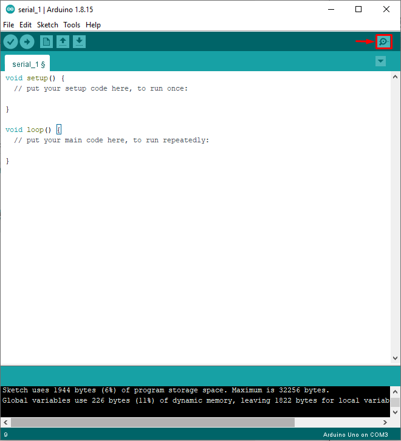

# Monitor Serial

O Monitor Serial é uma ferramenta muito útil na hora de interpretar dados de sensores, depurar e controlar a placa Arduino e através do computador. Para acessar a tela do Monitor Serial, certifique-se de que o Arduíno esteja conectado através da porta USB, e na sua IDE clique no ícone com uma lupa, no canto superior direito ou utilize o atalho `CTRL + SHIFT + M`.

Para utilizar o Monitor Serial, deve-se primeiramente inicializa-lo dentro da função `setup()`, para isso, utiliza-se a função `Serial.begin(velocidade)`, onde o valor de `velocidade` está relacionado com a taxa de transmissão de dados. Nos diversos experimentos que estaremos fazendo aqui, estaremos utilizando por padrão o valor de *9600*, porém lembre-se de que isso não é uma regra! Esse valor pode (e deve) ser modificado de acordo com as necessidades de cada projeto.

Na tabela abaixo são apresentadas algumas das funções mais comuns para manipular as portas serial.

| Função      | Descrição                                                                                      |
|-------------|------------------------------------------------------------------------------------------------|
| available() | Retorna o número de bytes disponível para leitura (o buffer armazena até até 64 bytes).        |
| print()     | Envia dados para o monitor serial no formato ASCII (ou seja, facilmente legível para humanos). |
| println()   | Possui a mesma função que o print(), porém irá adicionar uma quebra de linha logo em seguida.  |
| read()      | Retorna o primeiro byte de dados recebido disponível, ou -1 caso não haja nada disponível      |
| readBytes() | Lê caracteres da porta serial e os move para um buffer                                         |
| readBytesUntil() | Retorna o número de bytes lidos e colocados em um buffer. Os dados são lidos na porta seerial até que um caractere especificado seja atingido.|
| write()     | Envia dados em formato binário para a porta serial                                             |

Nos próximos tópicos serão apresentados alguns projetos simples demonstrando o funcionamento do Monitor Serial.
